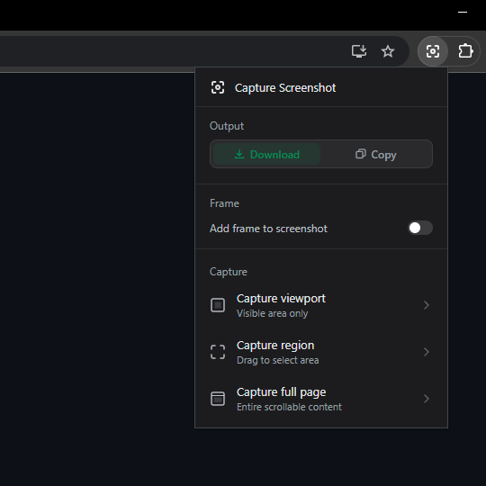
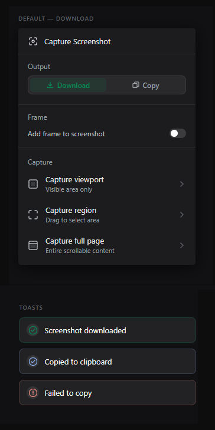
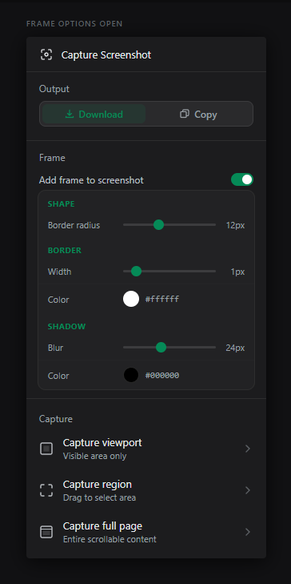

# Capture Screenshot - Chrome Extension

A Chrome extension for capturing browser screenshots with frame and shadow compositing, built as a clean alternative to the bloated tools that exist for this workflow.

## Preview
 

  
  
  

## Features

**Three capture modes:**
- 🎯 **Viewport** — captures exactly what's visible in the browser window, scrollbar excluded. Uses `chrome.tabs.captureVisibleTab()`.
- ✂️ **Region** — drag to select any area of the page with a live size indicator. Uses `chrome.tabs.captureVisibleTab()` after selection, with canvas cropping applied to the result.
- 📄 **Full page** — captures the entire scrollable document. Uses `chrome.debugger` to attach CDP to the active tab and calls `Page.captureScreenshot` with `captureBeyondViewport: true` and `Emulation.setDeviceMetricsOverride` to expand the render surface to the full document dimensions.

**Two output/save modes:**
- 💾 **Download** — saves as PNG with optional frame compositing applied
- 📋 **Copy** — writes directly to clipboard as `image/png` via the Clipboard API

**Frame compositing:**
Applies post-processing on a Canvas before export:
- Adjustable image border radius 
- Configurable border width and color
- Drop shadow with color
- All settings persisted via `chrome.storage.local`

**Other:**
- Toast notifications of the page on capture/copy/error

## Chrome Permissions

| Permission | Reason |
|---|---|
| `activeTab` | Required for `captureVisibleTab()` |
| `scripting` | Injects canvas processing and download/clipboard functions into the page |
| `clipboardWrite` | Required for `ClipboardItem` image write |
| `storage` | Persists output mode and frame settings across sessions |
| `debugger` | Full page capture via CDP |

## Install locally

1. Clone the repo
2. Go to `chrome://extensions`
3. Enable **Developer mode**
4. Click **Load unpacked** and select the repo folder

## License

This project is licensed under a custom non-commercial license. You are free to view, fork, and modify the code for personal and educational use.
